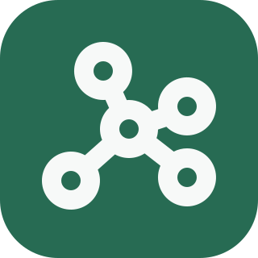
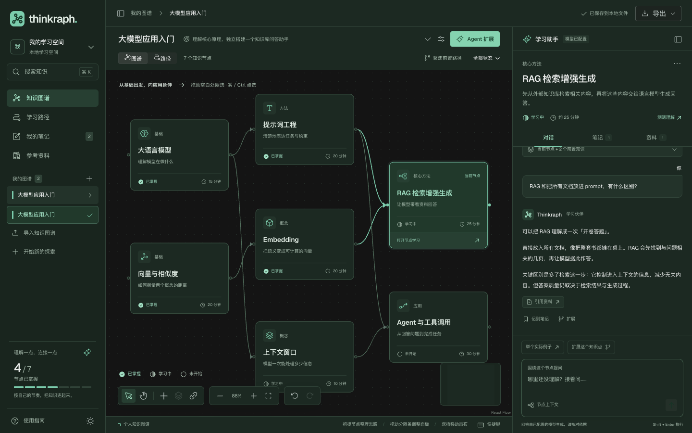
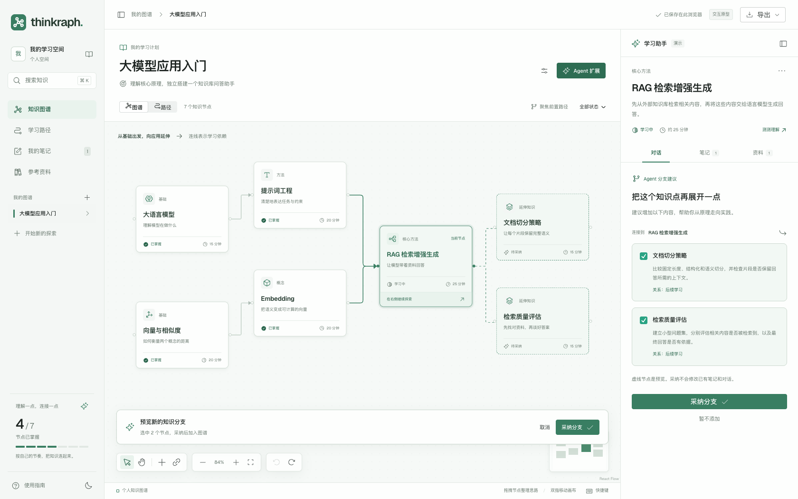
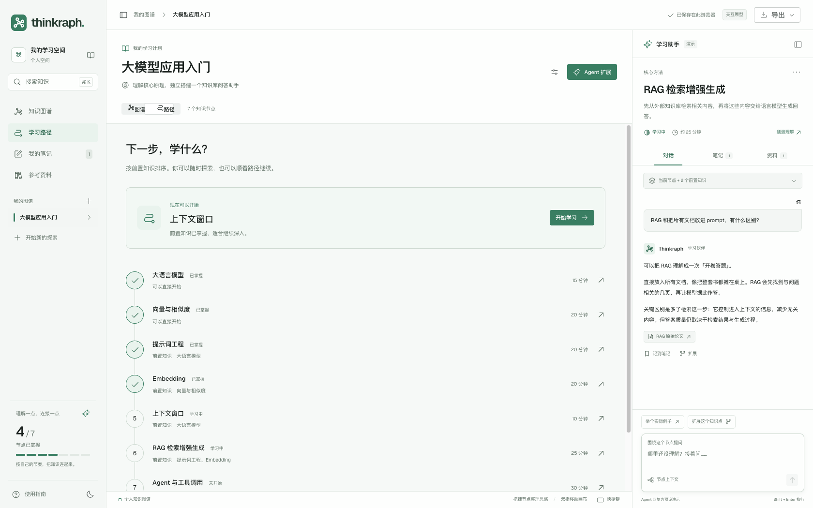
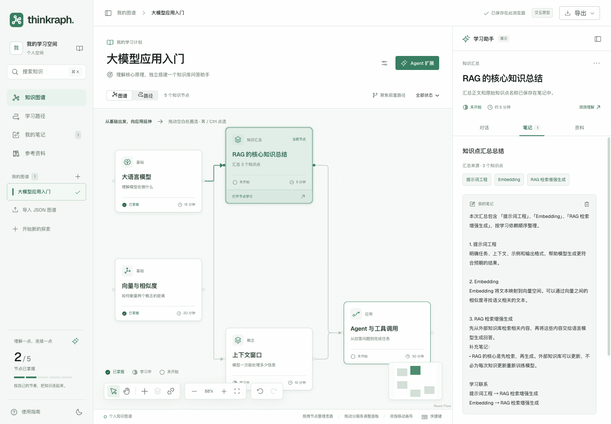
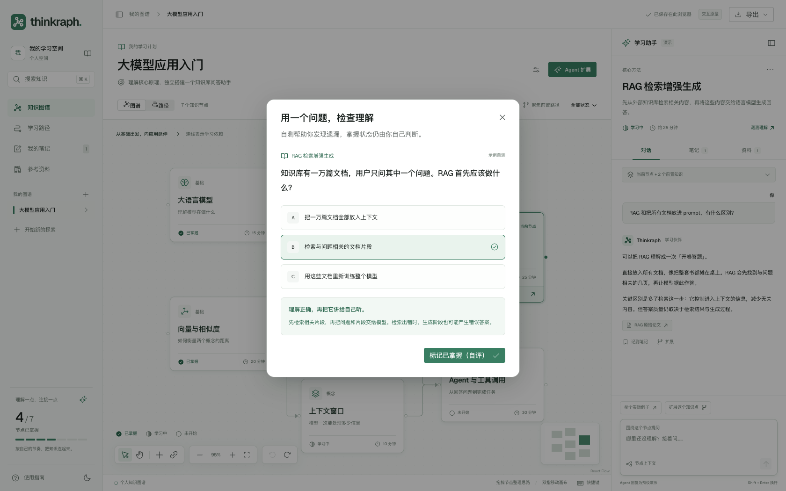

<p align="center">
  
</p>

<h1 align="center">Thinkraph</h1>

<p align="center"><strong>对话可以很长，理解需要结构。</strong></p>
<p align="center">以知识点组织对话，用依赖关系连接理解。<br />一个本地运行、持续生长的图式 Agent 学习工作台。</p>

<p align="center">
  <a href="https://ppixie.github.io/thinkraph/">项目网站</a> ·
  <a href="#快速开始">快速开始</a> ·
  <a href="#功能一览">功能一览</a> ·
  <a href="docs/local-usage.md">使用文档</a>
</p>



长对话留下了答案，却很难看清概念之间的关系、缺失的基础和下一步。Thinkraph 把知识点放进一张有向无环图，让每个节点保留自己的对话、笔记、资料与掌握状态。

## 功能一览

<table>
  <tr>
    <td width="50%" valign="top">
      <h3>追问分支，保留主线</h3>
      <p>从当前知识点扩展探索。Agent 先给出草稿，由你核对后采纳。</p>
      <a href="artifacts/02-branch-preview.png"></a>
    </td>
    <td width="50%" valign="top">
      <h3>按依赖找到下一步</h3>
      <p>看清前置知识，结合掌握状态选择后续学习方向，也能自由探索。</p>
      <a href="artifacts/08-learning-path.png"></a>
    </td>
  </tr>
  <tr>
    <td width="50%" valign="top">
      <h3>圈选知识，汇总理解</h3>
      <p>整理相关节点与笔记，用汇总节点替换选区、重连后续知识，支持撤销。</p>
      <a href="artifacts/summary-created.png"></a>
    </td>
    <td width="50%" valign="top">
      <h3>通过自测检查掌握</h3>
      <p>用题目与解析发现知识盲点，掌握状态由你确认。</p>
      <a href="artifacts/04-understanding-check.png"></a>
    </td>
  </tr>
</table>

[更多界面与截图说明](artifacts/README.md)，包括浅色主题、手机视图和节点笔记。部分交互截图来自原型阶段，图中内容为示例数据。

## 快速开始

需要 **Node.js 22.21.1 或更新版本**。

```bash
git clone https://github.com/PPixie/thinkraph.git
cd thinkraph
npm install
npm run dev
```

打开 [127.0.0.1:5173](http://127.0.0.1:5173)。首次进入为空空间，可新建图谱、加载示例或导入 JSON。

**连接 Agent：** 在「空间与图谱设置 → 模型与服务配置」中填写兼容 Chat Completions 的端点、模型与 API Key。手工编辑、笔记、学习路径和摘录汇总无需模型。

**保留知识：** 图谱与学习记录保存到本机 `data/`，支持单图及整个学习空间的 JSON 导入导出、备份与恢复。使用远程模型时，请求中的学习内容会发送到配置的端点。

项目网站是静态介绍页；完整工作台需要按上述方式在本机运行。

## 文档与开发

[本地使用与模型配置](docs/local-usage.md) · [架构设计](docs/architecture.md) · [实现与验收](docs/implementation.md) · [产品设计](docs/product-design.md)

开发检查：`npm run typecheck`、`npm test`、`npm run build`。生产运行与 GitHub Pages 部署方式见[使用文档](docs/local-usage.md)。
