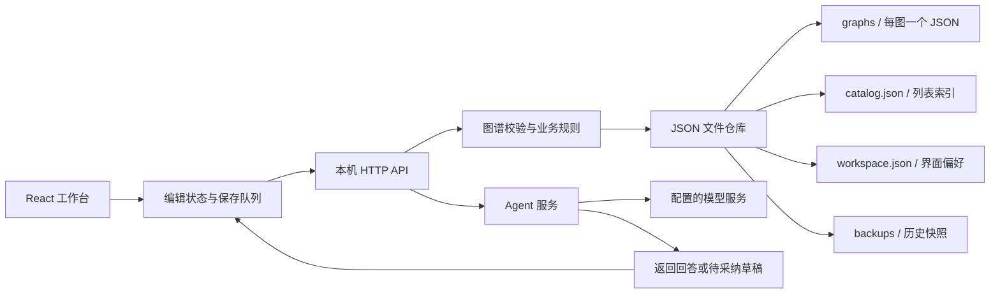

# Thinkraph 本地 JSON 版架构方案

状态：已按本方案实施本地 JSON 应用；具体验证证据见 implementation.md。日期：2026-09-17。下文目录划分为职责设计，实际源码以 README.md 中的模块说明为准。

## 1. 目标与架构决策

沿用当前原型的页面与交互，将其实现为可持续使用的本地学习工作台。图谱列表和图谱正文均写入本机 JSON 文件，不引入数据库。这里的「项目」指 Thinkraph 应用本身，首版不新增「项目 → 图谱」业务分组。

首版必须支持四项操作：**导入知识图谱、导出知识图谱、导入学习空间、导出学习空间**。学习空间指当前本地工作区中的全部未删除图谱、图谱列表及空间设置，不仅是 workspace.json。首版同一数据目录运行一个学习空间；空间导入支持合并和整体恢复，不额外引入多空间切换系统。

推荐采用 **React 工作台 + Node.js 本地服务 + JSON 文件仓库**。浏览器通过 HTTP 调用本机服务，只有服务端负责读写文件。这样可以统一实现自动保存、校验和恢复，不需要用户每次操作后手动下载 JSON。

| 部分 | 方案 | 原因 |
| --- | --- | --- |
| 前端 | 保留 React、Vite、Radix Themes、React Flow，逐步引入 TypeScript | 复用现有界面和交互，拆分目前集中在 App.jsx 的逻辑 |
| 本地服务 | Node.js + Fastify + TypeScript | 提供文件存储 API、统一错误处理及后续 Agent 接口 |
| 数据约束 | shared 中的 TypeScript 类型、Zod 运行时校验和 DAG 纯函数 | 文件、导入数据及模型输出都需校验，类型声明本身不能保护运行时输入 |
| 持久化 | 一张图谱一个 JSON；列表为独立 JSON 索引；空间批量导入通过目录版本切换提交 | 日常修改只保存单图，批量导入不会暴露半个学习空间 |
| 运行方式 | 单用户、本机单服务进程，可开多个浏览器标签页 | 用版本校验处理标签页冲突，首版不做多人协同 |
| Agent | 服务端 Provider 适配接口 | 密钥留在服务端，模型供应商和端点由配置决定 |

本机现有 Node 为 v22.21.1，可作为开发基线；实现时固定并验证依赖与运行时版本，不在本方案中追随未验证的最新版。



## 2. 当前原型与需要替换的部分

| 当前实现 | 正式实现 |
| --- | --- |
| App.jsx 从 localStorage 读取整个图谱库 | 启动时读取图谱列表，再按需读取当前图谱 |
| useEffect 在数据变化后重写整个图谱库和当前图谱 | 按 graphId 管理保存队列，只提交改变的图谱 |
| React Flow 节点对象兼作持久化对象 | 持久化业务字段，展示层补充选中、聚焦、测量尺寸和连线样式 |
| sourceMap、quizMap 通过示例节点 ID 查找 | 资料、测验和对话引用属于具体图谱，随 JSON 一起保存 |
| 预设回复、模板分支和内容摘录汇总 | 接入可配置 Agent 服务；手工编辑与本地汇总可独立使用 |
| 撤销历史跟随当前 Workbench | 历史、保存状态和异步任务均按 graphId 隔离 |
| 导入时静默过滤不合法连线 | 返回可读的错误报告；修复预览被用户采纳后才导入 |

保留现有多图谱切换、知识节点类别、曲线连线、圈选汇总、学习路径、笔记、参考资料、撤销恢复、主题、侧栏缩放和标题区收起功能。

## 3. 代码组织

保持一个仓库和一套 npm 脚本，暂不引入 monorepo 构建体系。

```text
thinkraph/
├── src/
│   ├── app/                    # 应用入口、布局、启动与错误页
│   ├── components/             # 通用控件和布局组件
│   ├── features/
│   │   ├── library/            # 图谱列表、新建、导入导出
│   │   ├── workspace/          # 学习空间导入导出、合并和恢复预览
│   │   ├── graph/              # 画布、节点、依赖和汇总预览
│   │   ├── learning/           # 学习路径、状态、测验
│   │   ├── inspector/          # 节点详情、对话、笔记、资料
│   │   └── settings/           # 界面偏好与模型配置状态
│   ├── state/                 # 工作区状态、图谱编辑器、撤销历史
│   └── services/              # API 客户端、按图保存队列、Agent 流读取
├── server/
│   ├── app.ts                 # Fastify 组装，可独立构造供测试使用
│   ├── main.ts                # 配置、工作区锁、启动和关闭
│   ├── routes/                # graphs、workspace、imports、agent
│   ├── services/              # 用例编排、导入预览、空间快照与导出
│   ├── repositories/          # 图谱 JSON 仓库、索引和偏好仓库
│   ├── storage/               # 原子替换、目录版本切换、备份、锁和恢复
│   └── agent/                 # 上下文组装、Provider、草稿校验
├── shared/
│   ├── schemas/               # 图谱、工作区和 API 数据约束
│   ├── domain/                # DAG、汇总替换和学习规则
│   └── migrations/            # 原型格式到正式格式的显式转换
├── tests/                     # 领域、文件仓库、接口和关键页面测试
├── data/                      # 默认本地数据目录，不提交 Git；包含 config.json
├── docs/
└── .env.example               # 配置项说明，不含实际密钥
```

`src/graph.js` 中的拓扑排序、依赖校验和汇总替换规则迁入 shared/domain，复用现有测试。组件只发出业务操作，不直接写文件，也不直接把 React Flow 的全部状态序列化。

前端先使用 React reducer、Context 和按图编辑会话，不为此引入额外全局状态框架；以后有性能证据再替换。

## 4. 本地数据目录

```text
data/
├── current.json               # 当前生效的 generationId
├── generations/
│   └── <generationId>/
│       ├── catalog.json
│       ├── workspace.json
│       ├── graphs/
│       │   ├── 4e727f1c-27b4-4f7f-891d-f6b84fdc5670.json
│       │   └── ...
│       └── commit.json        # 此目录版本的导入操作与完整性记录
├── backups/
│   └── <generationId>/<graphId>/
│       ├── revision-11.json
│       └── ...
├── imports/                   # 有期限的预览文件与幂等导入回执
└── .workspace.lock/            # 防止两个服务同时写同一个数据目录
```

默认目录为应用根目录下的 `data/`，不依赖启动命令所在的 cwd。通过 `THINKRAPH_DATA_DIR` 可指定独立的绝对路径，更新应用时继续使用原数据目录。构建产物只写入 dist，不能清理或覆盖 data。模型运行配置保存在数据目录的 `config.json`，服务启动时优先读取本地配置；端口、数据目录和文件限制等启动级参数仍由环境变量控制。

数据文件统一使用 UTF-8、格式化 JSON。文件名使用应用生成并由服务端校验的 UUID，与可修改的图谱标题无关。文件存储适用于本机普通磁盘；首版不支持两个进程或两台机器共同写入网络盘、同步盘目录。

下文 catalog.json、workspace.json 和 graphs/ 均相对于当前生效的 generations/<generationId>/。current.json 仅存 schemaVersion 与 generationId，目录路径由服务端拼接，不接收导入包中的路径。日常单图保存不创建新目录版本；学习空间批量导入才准备完整的新目录并切换 current.json。旧目录版本保留作为空间导入前快照。

### 4.1 catalog.json：图谱列表索引

```json
{
  "schemaVersion": 2,
  "generatedAt": "2026-09-17T08:00:00.000Z",
  "items": [
    {
      "id": "4e727f1c-27b4-4f7f-891d-f6b84fdc5670",
      "title": "大模型应用入门",
      "goal": "理解核心原理，搭建知识库问答助手",
      "nodeCount": 7,
      "masteredCount": 4,
      "revision": 12,
      "createdAt": "2026-09-17T07:00:00.000Z",
      "updatedAt": "2026-09-17T08:00:00.000Z"
    }
  ]
}
```

列表不包含节点、笔记或对话正文。标题、统计和版本由图谱文件计算，图谱文件是唯一业务事实来源；catalog 只是已落盘、可重建的索引。列表优先沿用 workspace.graphOrder 的有效 ID，未登记图谱按 createdAt、id 稳定追加，修改节点不使侧栏条目跳动。空间导入导出保留这个顺序。

### 4.2 graphs/<graphId>.json：完整图谱

以下为精简示例，展示一张独立、可校验的图谱文档。schemaVersion 表示文件格式版本，revision 表示内容保存版本，两者独立。

```json
{
  "schemaVersion": 2,
  "id": "4e727f1c-27b4-4f7f-891d-f6b84fdc5670",
  "revision": 1,
  "createdAt": "2026-09-17T08:00:00.000Z",
  "updatedAt": "2026-09-17T08:00:00.000Z",
  "deletedAt": null,
  "lastMutation": {
    "id": "46a0a51d-b0be-4974-bf1d-2ceca16485cf",
    "payloadHash": "由服务端计算的请求内容摘要"
  },
  "title": "大模型应用入门",
  "goal": "理解核心原理，搭建知识库问答助手",
  "preferences": { "level": "starter", "dailyMinutes": 30 },
  "nodes": [
    {
      "id": "llm",
      "position": { "x": 0, "y": 60 },
      "data": {
        "title": "大语言模型",
        "subtitle": "理解模型在做什么",
        "summary": "语言模型根据上下文预测后续 token。",
        "kind": "基础",
        "icon": "brain",
        "status": "todo",
        "minutes": 15,
        "createdBy": "manual"
      }
    }
  ],
  "edges": [],
  "notes": {
    "llm": [
      {
        "id": "note-1",
        "content": "用自己的话解释 token 预测。",
        "createdAt": "2026-09-17T08:00:00.000Z",
        "updatedAt": "2026-09-17T08:00:00.000Z"
      }
    ]
  },
  "messages": {},
  "sources": {},
  "quizzes": {}
}
```

补充约定：

- `nodes[].id` 只需在图谱内部唯一，保留原型节点 ID，业务引用一律携带 graphId。新建节点采用 UUID。
- 依赖边保存 `id/source/target/relation`，relation 首版固定为 `prerequisite`。父子关系从 edges 推导，不额外保存容易失去一致性的 parentId。
- 不保存 `selected/dragging/measured/focused/dimmed`、DOM 属性、虚线草稿，以及连线颜色等展示状态。位置持久化，曲线连线由渲染适配层统一生成。
- 正式状态为 todo、learning、mastered；draft 只属于未采纳预览。自建类别默认「自建知识」，类别与创建来源 createdBy 分开。
- `notes/messages/sources/quizzes` 按节点 ID 分组，记录拥有独立 ID。对话使用 role、content、createdAt、status、sourceIds，替代当前的 text 和 source 布尔值；测验保存题干、选项、答案、解释及实际作答记录。
- 来源记录保存标题、URL、类型和备注；所有 URL、测验、对话引用均限定在所属图谱内，避免不同图谱中同名节点误用示例资料。
- 汇总节点沿用 summarySources 与 summaryAnchorId。summarySources 是已删除节点的历史 ID/标题快照，明确允许不再指向现存节点；普通边和笔记引用不允许悬空。
- 图谱软删除仅更新 deletedAt 和 revision，列表排除已删除图谱。恢复清空 deletedAt 并产生新 revision，首版不自动永久删除正文。
- 迁移图谱另有可选 provenance 元数据，包含 legacyBrowserId、legacyGraphId 和 migratedAt；创建时校验、之后由服务端保留，普通编辑不应抹除迁移标识。

### 4.3 workspace.json：学习空间信息与界面偏好

保存 schemaVersion、id、name、revision、graphOrder、activeGraphId、theme、headerCollapsed、panelWidths，以及按 graphId 保存的 viewport 和最近查看节点。空间 ID 与图谱 ID 分开；不存在的最近节点允许回退，不应使图谱加载失败。generationId 属于本机存储版本，由 API 单独返回，不作为可移植空间身份。

选择、多选、搜索词、临时弹窗、尚未采纳的建议和撤销栈只放内存。界面偏好变化单独保存，不增加图谱内容 revision。localStorage 可用于主题首屏预加载及旧数据迁移识别，不再承担正式图谱存储。

## 5. 文件保存与一致性

### 5.1 一次保存的流程

1. 前端完成一次业务操作，立即更新对应图谱的编辑副本，并标记为「未保存」。
2. 保存队列将同一图谱的连续修改合并；文本输入默认防抖 500ms、最长等待 2s，拖动节点在拖动结束时提交。圈选、缩放和节点尺寸测量不触发图谱保存。
3. 请求携带 expectedRevision、mutationId 和完整的可持久化图谱内容。服务端在单一写入队列内读取最新 revision，校验结构、引用和完整 DAG。
4. 更新已有图谱前，将上一份有效正文备份到 backups；备份失败则停止本次变更，保留原文件。
5. 在目标文件所在目录创建唯一临时文件，以排他创建方式打开，写入完整内容，完成文件同步并关闭，再 rename 替换正式文件。在目标平台支持时同步父目录，具体崩溃恢复行为必须通过故障注入验证。
6. 正文替换是内容提交点，revision 递增、updatedAt 由服务端生成。更新内存列表并原子替换 catalog.json。
7. 返回已提交 revision。前端只将该次请求对应的编辑版本标为已保存，期间产生的更新继续排队，不能被旧响应覆盖。

同一图谱前端最多有一个保存请求在途；服务端首版使用工作区级串行写入队列，避免 catalog 和各图谱更新相互覆盖。读请求在写入结束前返回旧的完整版本，结束后返回新的完整版本，不读取半写入文件。

Node 文件 API 不自动协调并发写入，官方文档也提醒同一文件并发修改可能破坏数据，因此队列属于文件仓库的职责。[Node.js 文件系统文档](https://nodejs.org/download/release/latest-jod/docs/api/fs.html)

### 5.2 列表与正文的两文件一致性

不能把「先写图谱，再写列表」描述成跨文件原子事务。本方案通过“正文权威、列表可重建”避免依赖这种保证：

- 正文未提交：报告失败，原正文和原列表仍有效。
- 正文已提交、索引写入失败：内容保存仍成功，内存列表使用最新数据；响应附带索引待修复状态，后台重试索引，不要求客户端再次创建或重复应用图谱修改。
- 进程在两次写入之间退出：下次启动扫描图谱文件，重新生成 catalog 后提供列表服务。
- catalog 缺失或损坏：从有效正文重建，不恢复成空库或自动覆盖示例。
- 单张图谱损坏：保留损坏文件，在启动报告列出该图谱，其他有效图谱继续可用。提供从已验证备份恢复的明确操作，不静默回滚用户内容。
- 存在不认识的较新 schemaVersion：该文档禁止写入并提示升级，不能按旧格式裁剪后覆盖。

每张图谱默认保留最近 10 个有效修订备份；旧备份仅在本次正文安全提交后清理。临时文件不视为已提交正文。服务正常退出时等待已接收的写入完成；启动时处理遗留临时文件和有效备份。

### 5.3 冲突、重试和关闭页面

- 两个标签页基于同一个 revision 保存：第一个成功，第二个收到 409。第二个保留本地编辑副本，提供载入磁盘版本、导出本地副本或另存图谱，不自动覆盖另一标签页。
- mutationId 在网络重试时保持不变。若与正文 lastMutation 的 ID 和摘要一致，返回此前成功结果；同 ID 不同内容拒绝。若已有更晚提交，则按 revision 冲突处理，不重新应用旧修改。
- 普通新建在客户端生成目标 graphId 与 mutationId，服务端验证后创建；文件导入的目标 ID 由服务端预览生成并固定在映射表中，客户端为提交生成 mutationId。重试同一请求不额外生成图谱，复制/再次导入是新的用户动作，使用新 ID。
- 每个编辑会话维护 localEditVersion 与 confirmedRevision；保存、撤销恢复、后台回答到达都通过同一队列。
- 切换图谱时先刷新当前保存队列；保存失败时保留该图未保存副本与提示，不能丢弃旧图状态。
- 有未保存修改或请求在途时，刷新、关闭页面触发离开提示。不依赖 beforeunload 内的异步请求保证落盘；崩溃后只能保证恢复已确认保存的数据。
- 外部手工编辑文件应先停止本地服务。首版不支持运行中热编辑 JSON，避免绕开版本机制。
- 用排他工作区锁阻止第二个服务写入相同数据目录；发现遗留锁先验证拥有者是否仍存在，不能仅按超时抢占活动服务的锁。

### 5.4 学习空间批量导入的提交

学习空间导入不逐张向当前目录写入。它在单实例服务的工作区写入队列中完成如下流程：

1. 预览阶段解析导入包，完成结构、DAG、ID 与引用校验，记录文件摘要、导入模式、ID 映射、当前 generationId、workspace revision 和各图谱 revision，形成有期限的 importId。
2. 用户执行预览结果时，前端暂停本标签页的新编辑与 Agent 采纳，刷新全部保存队列；服务端进入工作区写入队列并核对预览基础版本。任一变化都返回 409，要求刷新预览，不能按旧预览覆盖新编辑。
3. 创建新的 generation 目录。合并模式复制当前完整有效数据再追加新图谱，恢复模式按导入包构造目标空间。不能使用与当前文件共享可写 inode 的硬链接；当前目录在切换前保持原样。
4. 写入并同步全部图谱、workspace、重建的 catalog 和 commit.json，验证数量、引用与摘要。commit.json 记录 importId、mutationId、包摘要、模式、前一 generationId 和映射结果。空间不足、校验或写入失败时，current.json 不变，本次导入整体失败。
5. 用同目录临时文件原子替换 current.json，将 generationId 切到新目录，这是批量导入的提交点。适用平台的文件与目录同步规则沿用 5.1，需做退出点验证。
6. 提交期间对 API 读取设置屏障，读请求不得跨目录版本取数。切换并重载索引完成后释放屏障，返回导入回执；调用方重新加载空间与图谱，清除旧编辑历史和过期 Agent 草稿。

每个 API 响应返回当前 generationId；所有写请求增加 X-Workspace-Generation，批量导出也核对客户端预期版本。旧标签页或旧异步任务即使 graphId、revision 恰好相同，也会因目录版本不同被拒绝，保留本地副本并提示重新加载。

current.json 切换前退出，启动继续使用旧目录；切换后退出，启动使用已经准备完整的新目录。遗留未提交目录不会自动生效。current.json 自身损坏时进入明确的恢复流程，不能猜测“最新目录”或初始化空库。

导入回执按 mutationId 持久化在 imports；若指针已切换而回执尚未落盘，启动依据新目录 commit.json 补齐，写接口在补齐前不开放。重试相同 mutationId 与包摘要返回原结果，不重复追加。不同请求使用同一 mutationId 拒绝执行。

单图导入使用相同回执机制，在新图谱的服务端 provenance.import 中保留 importId、mutationId 和包摘要。图谱正文已创建但回执失败时阻止后续写入，启动可从该记录补齐回执；不能因为正文后来被编辑、lastMutation 改变而把旧导入重做一次。已提交回执不随预览文件到期删除。

空间切换前的完整目录作为本地回退点保留；默认保留最近 3 次空间切换快照，清理前保证对应回执已持久化，且只在新提交成功后执行。恢复回退点也通过创建新 generation 和切换指针完成，不直接把旧标签页熟悉的 generationId 重新激活。单图最近 10 次备份与空间级快照是两种独立保留策略。

## 6. HTTP 接口

开发环境由 Vite 将 `/api` 代理到本机服务；构建后由该服务同时提供前端静态资源和 API，浏览器始终使用同源相对路径。

| 接口 | 作用 | 写入规则 |
| --- | --- | --- |
| GET /api/health | 服务状态、存储可写状态和恢复报告摘要 | 无写入 |
| GET /api/graphs | 图谱列表、可恢复问题 | 默认不返回正文或已删除条目 |
| POST /api/graphs | 新建空图、模板图或采纳生成草稿 | graphId + mutationId，成功返回完整正文 |
| GET /api/graphs/:id | 读取单张图谱 | 返回文档及 revision |
| PUT /api/graphs/:id | 替换一张图谱的业务内容 | expectedRevision + mutationId + document |
| DELETE /api/graphs/:id | 软删除图谱 | expectedRevision + mutationId |
| POST /api/graphs/:id/restore | 恢复软删除图谱 | expectedRevision + mutationId |
| GET /api/workspace | 获取空间信息、偏好及 generationId | 无业务图谱写入 |
| PATCH /api/workspace | 更新空间名称、列表顺序或界面偏好 | 独立 revision，冲突后重新读取并重放具体字段修改 |
| POST /api/imports/preview | 自动识别图谱包、空间包和旧版 JSON，返回校验与冲突预览 | 可暂存文件和 importId，不改变当前空间 |
| POST /api/imports/:importId/commit | 按预览导入图谱，或合并/恢复学习空间 | mutationId + 预览基础版本；单图原子保存，空间按 5.4 提交 |
| GET /api/imports/:importId | 查询导入结果与 ID 映射 | 断线后查询同次导入，避免重复提交 |
| GET /api/graphs/:id/export?format=json\|markdown | 导出单张已保存图谱 | JSON 为完整可再导入包，Markdown 为可读内容；前端先完成该图保存 |
| POST /api/workspace/export | 导出完整学习空间 JSON 包 | 校验 expectedGenerationId 与 revision 清单，在写入队列中取得一致快照 |
| GET /api/workspace/snapshots | 查看导入前的本地回退点 | 只返回快照时间、空间名称与图谱数量 |
| POST /api/workspace/snapshots/:id/restore | 恢复选定的导入前快照 | 展示预览后提交，核对基础版本并创建新的 generation |
| POST /api/agent/chat | 节点对话 | 以流式响应返回事件，不绕过编辑保存队列 |
| POST /api/agent/generate | 创建图谱、扩展、汇总、测验草稿 | 返回结构化草稿与基础版本，采纳后走普通保存 |

普通保存请求示例：

```json
{
  "expectedRevision": 12,
  "mutationId": "16cb8a56-585b-40c7-a077-68657b0182c6",
  "document": {
    "title": "大模型应用入门",
    "goal": "理解核心原理，搭建知识库问答助手",
    "preferences": { "level": "starter", "dailyMinutes": 30 },
    "nodes": [],
    "edges": [],
    "notes": {},
    "messages": {},
    "sources": {},
    "quizzes": {}
  }
}
```

示例 document 为合法空图；实际保存提交完整内容。schemaVersion、id、revision、createdAt、updatedAt、deletedAt、lastMutation、provenance 由服务端维护，普通 PUT 不能修改它们。

统一错误体包含 code、message、details、requestId。区分 400 格式错误、404 图谱不存在、409 图谱/目录版本冲突、410 导入预览过期、413 文档过大、422 业务规则错误、503 存储不可用。未提供写入版本或 X-Workspace-Generation 返回明确参数错误。响应丢失后允许用 importId 或持久化的 mutationId 查找同次导入回执。

Fastify 负责路由和统一响应；路由入口统一通过本项目固定的 Zod schema 解析输入，错误由公共处理器映射为 HTTP 响应，避免另外手写一套重复的数据约束。不能接受用户上传的 schema 作为服务端可执行校验器；Fastify 官方也明确区分应用代码与不可信 schema。[Fastify 校验文档](https://fastify.dev/docs/latest/Reference/Validation-and-Serialization/)

## 7. 业务操作的提交边界

一张图谱的节点、边、笔记、资料和对话始终在同一个文件中提交。删除节点、采纳分支和汇总替换都是一次完整变更，不能分几次保存出中间不合法状态。

多节点汇总严格沿用已确定的规则：

1. 按学习依赖拓扑顺序选择最早节点，同级按 nodes 稳定顺序判断。
2. 汇总节点占据最早节点的位置并继承它的全部父节点。
3. 删除全部被选原始节点，移除选区内部连线。
4. 原始节点的所有外部子节点连接到汇总节点，重复边去重；其他选中节点的父节点不额外并入。
5. 原笔记内容进入汇总草稿，来源 ID 和标题保留为历史记录；原节点的独立内容按当前替换语义清理。
6. 提交前验证整个 DAG、普通引用和唯一 ID；前端一次撤销即可恢复整次操作。

撤销恢复修改的是业务文档副本，保存仍产生递增的新 revision，不回退服务端版本号。刷新后不保留撤销栈，历史文件备份承担跨重启恢复职责。

## 8. Agent 的实现边界

正式项目预留并实现真实模型调用通路；供应商、模型与凭据由服务端配置，不硬编码具体品牌。未配置模型时，手工编辑、路径计算、笔记、本地摘录汇总和模板创建仍可使用；界面说明「未配置模型」，预设示例不能当作真实模型结果。

服务端从已保存图谱组装学习目标、当前节点、前置节点摘要、选定资料和对话。请求绑定 requestId、graphId、nodeId、baseRevision，限制上下文长度。只有配置模型且用户发起 Agent 操作后才调用配置的端点。

对话通过 POST 请求的响应流返回 delta、done、error 事件；前端使用 fetch 读取事件流并支持取消。用户提问先保存，模型正文流在内存中展示，完成或用户停止时作为对应图谱的业务变更排入保存队列；意外关闭可能丢失尚未提交的流片段，但不会显示为已保存。

模型服务只返回回答或草稿，不在后台另起一套写文件路径。切换图谱后结果仍路由到原图谱会话；原节点已删除、被汇总或已不适用时，不得重新创建悬空消息。分支、汇总与测验需结构校验；采纳时核对基础版本，过期则重新预览，不静默替换当前图。

第一版资料支持已有 URL 与手工录入，不包含文件解析、联网检索或向量检索系统。密钥使用服务端环境变量，不能使用 VITE_ 前缀，也不进入图谱 JSON、导出文件或前端 bundle。

## 9. 知识图谱与学习空间的导入导出

### 9.1 范围与界面入口

| 操作 | 文件与范围 | 默认行为 |
| --- | --- | --- |
| 导出知识图谱 | `<名称>.thinkraph-graph.json`，一张完整图谱 | 包含节点、依赖、位置、类别、掌握状态、笔记、对话、资料、测验与汇总来源 |
| 导入知识图谱 | 新版图谱包，兼容原型单图 JSON 和有效的旧版正文 | 作为独立图谱追加，生成新 graphId，不覆盖已有图谱 |
| 导出学习空间 | `<空间名称>.thinkraph-space.json`，全部未删除图谱与空间信息 | 包含图谱列表及顺序、每张图的完整正文、空间名称、当前图谱和界面偏好 |
| 导入学习空间 | 具有完整正文的空间包，兼容原型图谱库 JSON | 默认合并追加；用户也可选择整体恢复空间 |

图谱级入口保留在「我的图谱」和顶部当前图谱导出菜单。学习空间名称旁增加空间菜单，提供「导入学习空间」「导出学习空间」；导入弹窗明确显示文件类型、图谱数量、节点数量、模式及对现有内容的影响。

Markdown 继续作为单图阅读导出格式，不作为无损往返格式。四项正式导入导出均以 JSON 为标准。学习空间包无需依赖原目录路径，可在另一台安装本应用的设备上导入。

### 9.2 可移植文件格式

可移植包与内部存储格式分离：用 format 区分 `thinkraph.graph` 和 `thinkraph.workspace`，用 formatVersion 管理包装格式；图谱内容的 schemaVersion 继续表示业务格式。exportId 为每次导出生成的 UUID，用于追溯与重复导入提示，不能当作目标文件路径。

单图包示例使用合法空图，以展示完整包装结构：

```json
{
  "format": "thinkraph.graph",
  "formatVersion": 1,
  "exportId": "b05d2398-6b28-43f1-ab0c-2434a93de286",
  "exportedAt": "2026-09-17T08:00:00.000Z",
  "graph": {
    "schemaVersion": 2,
    "id": "4e727f1c-27b4-4f7f-891d-f6b84fdc5670",
    "title": "大模型应用入门",
    "goal": "搭建知识库问答助手",
    "preferences": { "level": "starter", "dailyMinutes": 30 },
    "nodes": [],
    "edges": [],
    "notes": {},
    "messages": {},
    "sources": {},
    "quizzes": {}
  }
}
```

完整学习空间包示例：

```json
{
  "format": "thinkraph.workspace",
  "formatVersion": 1,
  "exportId": "04fe1bb5-8c1c-44f7-b5f8-3e51bdbd2f98",
  "exportedAt": "2026-09-17T08:00:00.000Z",
  "workspace": {
    "id": "5241c9cd-4f42-4aa9-8377-3c1b876967c9",
    "name": "我的学习空间",
    "activeGraphId": "4e727f1c-27b4-4f7f-891d-f6b84fdc5670",
    "settings": {
      "theme": "light",
      "headerCollapsed": true,
      "panelWidths": { "left": 220, "right": 374 },
      "graphViews": {}
    }
  },
  "catalog": {
    "graphIds": ["4e727f1c-27b4-4f7f-891d-f6b84fdc5670"]
  },
  "graphs": [
    {
      "schemaVersion": 2,
      "id": "4e727f1c-27b4-4f7f-891d-f6b84fdc5670",
      "title": "大模型应用入门",
      "goal": "搭建知识库问答助手",
      "preferences": { "level": "starter", "dailyMinutes": 30 },
      "nodes": [],
      "edges": [],
      "notes": {},
      "messages": {},
      "sources": {},
      "quizzes": {}
    }
  ]
}
```

`catalog.graphIds` 为顺序列表，必须与 graphs 中的 ID 一一对应且无重复，导入后转换为 workspace.graphOrder；标题与统计重新从正文计算，不复制内部 catalog 缓存。workspace.activeGraphId 必须属于包内图谱；空空间时为 null。graphViews 的图谱与节点引用需校验；纯视图的失效引用可在预览中提示并重置，不能静默修改知识依赖。

导出采用明确字段白名单：保留知识内容、笔记和对话时间、测验记录、引用及汇总来源；不携带内部 revision、lastMutation、generationId、浏览器迁移标识、日志、锁、历史备份和软删除图谱，也不打包环境变量、模型配置凭据或存储目录路径。用户主动写入笔记的文本原样保留，不将内容过滤误当作配置脱敏。资料 URL 及备注随包保存，URL 指向的网页与文档正文不随包离线归档。空间包表示当前可用学习内容的完整快照，不是整个 data 目录的镜像。

### 9.3 导入模式与 ID 处理

| 场景 | 图谱处理 | 学习空间与偏好处理 |
| --- | --- | --- |
| 导入单张图谱 | 总是生成新 graphId；内部节点、边、笔记与引用 ID 保留 | 加到当前列表末尾并切换到新图；空间名称与全局偏好不变 |
| 空间合并导入（默认） | 为包内每张图生成新 graphId，按包内顺序整体追加；不进行节点级自动合并 | 保留当前空间 ID、名称、当前图谱和偏好；当前为空库时可聚焦首张导入图 |
| 空间合并并应用偏好（可选） | 同默认合并 | 预览中明确勾选后才应用包内界面偏好、视图与映射后的当前图谱，空间 ID、名称仍保留 |
| 空间整体恢复 | 新目录仅包含包内图谱，保留包内 graphId；原空间数据留在导入前快照 | 恢复包内空间 ID、名称、图谱顺序、当前图谱和偏好；缺失的可选偏好使用默认值 |

同名图谱允许并存，不按名称推断同一个图谱；预览显示同名条目并允许改名。合并时图谱 ID 即使没有冲突也统一重建，避免跨来源身份混淆。所有 graphId 引用，包括 activeGraphId、graphOrder 和 graphViews 的键，都通过同一映射表重写；节点 ID 和 summarySources 中的历史节点 ID 保持原语义。

导入内容不沿用源服务的保存版本：新图谱 revision 从 1 开始，lastMutation 重新生成，原知识记录的时间保留；来源 exportId、源图谱 ID、源空间 ID 以新的可选 provenance.import 记录追溯。空间整体恢复产生全新 generationId，用于隔离旧标签页的写请求。

首版单图导入只支持追加副本。空间整体恢复是单独的明确操作，预览必须列出“当前多少张图将退出当前空间、导入多少张图、哪些偏好将恢复”，并提供执行按钮。用户选择后生成回退点再提交。导入空空间默认允许无操作的合并；整体恢复为空空间必须在同样的预览中明确显示清空结果。

### 9.4 导入流程与失败语义

流程为选择文件 → 自动识别格式 → 校验与兼容转换 → 选择模式并查看结果 → 执行导入 → 返回数量与映射。校验涵盖文件大小、格式版本、重复 ID、DAG、正文引用、图谱列表完整性以及设置类型。

预览只创建临时导入记录，默认 30 分钟过期。只信任服务端保存的原始文件、摘要和转换结果，提交不能由浏览器另传一份未预览正文。修改模式、标题或修复选项需生成更新后的预览；所有错误和修复都展示到具体图谱。

空间包中任一图谱存在阻断错误，则整包不提交；用户修复文件后重新预览，不会留下已导入前几张的半成品。显式提供“仅取有效图谱”时，必须生成新的合并预览，不能用于宣称完整恢复。较新的不支持格式拒绝导入；可兼容的旧版本由固定迁移器转换，不能靠静默删除未知字段通过校验。

单图导入复用图谱仓库的一次创建；空间合并与恢复均使用 5.4 的目录版本切换。服务重启后，已提交 importId/mutationId 可查询到原回执；未提交且已过期的预览要求重新上传。同一个 exportId 再次作为新的用户操作导入可创建副本，但预览先提示曾导入过；网络重试同一次 commit 不创建副本。

### 9.5 一致导出与限制

单图导出先保存该图；空间导出先刷新当前客户端所有图谱和偏好保存队列，并在保存期间暂停本标签页新编辑。存在保存冲突或失败时不能把未保存内容声称为已包含；用户可先解决冲突，或明确选择导出磁盘上已保存版本。

服务端在工作区写入队列中核对 generationId 和客户端已确认的 revision 清单，读取空间、列表与全部图谱，得到同一时点的完整内存快照。读取期间其他标签页的写入排队，取得快照后释放队列再进行序列化和下载；不能按请求到达时的列表搭配之后变化的正文。单图导出也应绑定客户端已确认 revision。

空间中存在无法读取的有效条目或损坏文件时，完整空间导出失败并列出问题；不能漏掉该图后仍宣称完整导出。空空间可导出，结构为 graphs: []、catalog.graphIds: [] 和 activeGraphId: null。

导入与导出使用相同大小上限，首版建议单图包 12 MiB、单图业务正文 10 MiB、空间包 100 MiB 且最多 200 张图，均可配置。预览也校验合并后目标空间的数量上限，不能只校验包内数量。输出超限时明确提示调整本机上限或改为单图导出，不截断正文。空间导入预检暂存和复制所需空间，写入中仍按实际磁盘错误处理。未来增加大包流式解析或 ZIP 容器时另增格式版本，首版不依赖压缩包解压流程。

## 10. 原型数据迁移

1. 前端检测当前浏览器已有的 thinkraph-maps-v1；不存在时再检查 thinkraph-prototype-v1，不把两份缓存重复导入。
2. 提供一次「迁移浏览器图谱到本地文件」入口，展示图谱数量和校验结果。服务端无法直接读取浏览器 localStorage。
3. 为每张待迁移图谱生成新的文件 UUID，保留内部节点 ID 与排序；旧 notes 字符串转换为带 ID 的记录，messages.text 转为 content，补足缺失元数据并标记来源为 legacy。
4. 示例资料和测验只在确认图谱为对应示例结构时补入；不能只凭节点 ID 为 rag 就绑定示例资料。其他未知的旧 source 布尔引用列为迁移提醒，不编造出处。
5. 非法边、重复 ID 和不支持字段先列出报告，不静默裁剪。每张图谱校验通过后按普通创建接口保存。
6. 在图谱元数据保存浏览器迁移来源标识和旧图谱标识；以这两个标识识别已迁移项，支持中断后继续，避免每次刷新重复生成图谱。
7. 成功后读取文件核验数量和内容，映射 activeGraphId。保留原浏览器数据，迁移完成标记用于关闭提示。

上述浏览器迁移是兼容旧缓存的专用流程，以单张图谱为提交单位，可部分完成并明确列出失败项；它与第 9 节正式空间包的整包提交保证不同。将旧图谱库作为文件导入时，先转换成空间包并按第 9 节执行整包校验与提交。单图再次导入生成独立副本，空间整体恢复使用明确的恢复模式。

## 11. 本机服务与运行约定

- 默认绑定 127.0.0.1，开发后端端口建议 3001，前端保持 5173；正式运行由本机服务提供构建后的页面。
- 校验 Host 和写请求 Origin，只接受本应用同源访问，不开放任意跨域；不提供客户端指定任意磁盘路径的接口。
- graphId 严格限定为 UUID，文件仓库固定数据根目录，并拒绝越界路径与不符合预期的符号链接。静态资源路由只能访问 dist，不暴露 data、备份或配置文件。
- 日志记录请求 ID、图谱 ID 和错误类别，避免记录密钥、完整笔记及对话正文。
- 初期按单图最多 1,000 个节点、5,000 条边和 10 MiB 文档设置可配置保护上限，目标验证 200 张图谱。它们是首版验收边界，尚不是性能测量结论。
- 启动时先解析 current.json，只扫描当前目录版本中的正文，再构建内存列表与磁盘索引；不将历史目录、备份与导入暂存内容加入当前列表。正常运行读取单图，编辑器只缓存打开过的图谱。数据量超过边界后再评估文件拆分，不提前引入数据库。
- 真正的新目录显示空库，并提供迁移、创建与载入示例入口；有损坏文件或未知版本文件的目录不能当作新目录初始化，避免误覆盖已有内容。
- 计划提供 npm run dev、npm run build、npm start、npm test、npm run typecheck。dev 同时启动前后端，start 不依赖 Vite 开发服务器。

## 12. 实施顺序与验收

| 阶段 | 交付 | 完成标准 |
| --- | --- | --- |
| 1. 数据与文件服务 | shared 类型/规则、JSON 仓库、API、目录版本切换、备份恢复、可移植包格式 | 单图与完整空间 JSON 可以往返；重启、导入中断和多标签页均不损坏已保存数据 |
| 2. 原型接入 | 拆分 App.jsx、按图保存、单图/空间导入导出入口、模式预览与迁移 | 四项导入导出均可操作，能合并空间与整体恢复；清空浏览器缓存后仍可读取图谱 |
| 3. 学习能力落地 | 资料与测验入图谱、完整引用、Provider、真实对话和草稿 | 配置模型后完成提问、扩展、汇总和测验；无模型仍可使用本地功能 |
| 4. 完整交付 | 生产启动、说明文档、打包与关键场景测试 | 从干净环境启动、迁移、编辑、关闭和恢复的完整流程可重复 |

优先验证与文件保存直接有关的风险，不为每个低风险控件新增重复测试：

- 仓库使用临时目录集成测试：并发保存、旧 revision、重复 mutationId、磁盘写失败、损坏 JSON、索引重建与备份恢复。
- 故障注入覆盖“临时文件写入后”“正文替换后索引更新前”等退出点，验证既无半个 JSON，也不把已提交图谱隐藏成空库。
- 迁移覆盖旧图谱库、旧单图、部分失败后重试、同节点 ID 的不同图谱、较新 schemaVersion 和无效依赖。
- 单图 JSON 往返需保持节点、边、位置、类别、掌握状态、笔记、对话、资料、测验与汇总来源一致，允许新 graphId 与服务端元数据变化；Markdown 不纳入无损往返验收。
- 空间包往返需保持所有有效图谱、列表顺序、空间名称、当前图谱和偏好；验证空空间、同名同 ID 图谱、合并映射、恢复模式和旧格式兼容。
- 导入失败测试覆盖重复提交、响应丢失、预览过期、预览后新编辑、空间不足，以及 current.json 切换前后退出；整包结果只能是旧空间或完整的新空间，旧标签页写入必须被拒绝。
- 导出测试覆盖并发编辑、进行中的模型输出、保存失败、损坏图谱和超限文件，确认完整空间快照没有漏图或混用不同保存时点的数据。
- 包字段白名单测试确认没有导出模型配置密钥、存储目录路径、锁、备份或内部并发控制字段；业务内容与用户引用不得被错误裁剪。
- 浏览器端覆盖编辑后刷新、切图时在途保存、连续拖动、保存失败、两个标签页冲突、汇总后撤销及再次保存。
- 领域测试保留现有 15 项 DAG/汇总用例，并补充正式持久化字段、内容引用与删除清理验证。
- Agent 测试覆盖未配置、超时、取消、输出非法、草稿过期和生成期间删除节点，不能让测试依赖付费模型在线。

本次仅形成架构方案，现有原型和浏览器数据不作迁移或格式变更。后续从阶段 1 的文件仓库与接口开始，再逐步接入现有页面。
